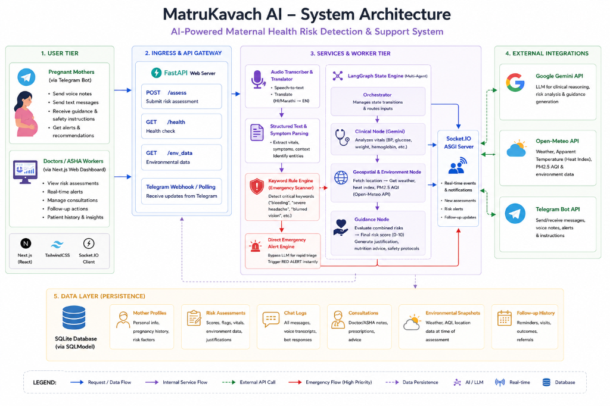
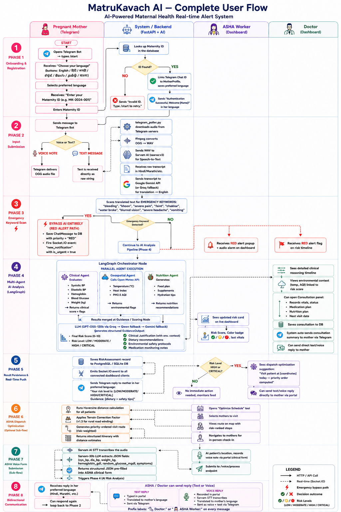

# 🛡️ MatruKavach AI
### AI-Powered Maternal Health Risk Detection & Real-Time Alert System

---

## 📌 The Problem

Maternal mortality remains one of the most preventable yet persistent public health crises in rural India. Despite national programs like Janani Suraksha Yojana, thousands of preventable maternal deaths occur annually — primarily due to **three systemic failures**:

1. **Delayed Detection**: Warning signs of life-threatening conditions such as Preeclampsia, severe anaemia, and gestational diabetes go unnoticed until they become emergencies — because routine check-ups are infrequent and self-reporting is limited.
2. **Communication Barriers**: Pregnant mothers in rural and semi-urban areas speak regional languages (Hindi, Marathi, Kannada, Telugu, Tamil, Bengali) and have no reliable, language-accessible channel to report symptoms to healthcare workers between visits.
3. **Overburdened Frontline Workers**: ASHA (Accredited Social Health Activist) workers manage large patient loads with no intelligent prioritisation. They cannot determine which mother needs an urgent home visit today versus which can wait — leading to critical cases being missed.

> **The gap is not medical knowledge — it is timely, intelligent information flow.**

---

## 💡 Solution Overview: Introducing MatruKavach AI

MatruKavach AI is an intelligent, context-aware maternal healthcare assistant designed to minimise preventable maternal mortality by detecting risks early. It bridges rural healthcare gaps by connecting pregnant mothers directly with ASHA (Accredited Social Health Activist) workers and doctors through a real-time, multi-agent AI system.

The system fuses **environmental data (air quality, temperature, heat index)**, **clinical vitals (blood pressure, glucose, haemoglobin)**, and **local language voice messages (Hindi, Marathi, Kannada, Telugu, Tamil, Bengali)** to deliver proactive, real-time early warnings — all accessible via Telegram with no app download required.

---

## 📸 Project Visualisations & Architectural Diagrams

### 1. System Architecture Diagram
Illustrates how client interactions, the API server, database tables, and the multi-agent orchestration layer coordinate.



### 2. User Flow & Processing Lifecycle
An 8-phase end-to-end walkthrough from patient onboarding to bidirectional communication.



---

## 💡 How It Works (End-to-End Flow)

1. **Onboarding via Telegram**: A pregnant mother opens the bot, selects her preferred language from 7 options, and authenticates with her Maternity ID — linking her Telegram account to her clinical profile.

2. **Voice or Text Input**: She sends a voice note (Hindi/Marathi/etc.) or text message. Voice notes are transcribed using **Sarvam AI (saaras:v3 STT)**, converted from `.oga → .wav` via `ffmpeg`, and translated to English via **Google Gemini** (with Groq as fallback).

3. **Emergency Keyword Scan**: The translated text is instantly scanned for critical keywords (`bleeding`, `khoon`, `severe pain`, `water broke`, `vomiting`, etc.). If matched — AI is **bypassed entirely** and an instant **RED alert** fires via Socket.IO to all ASHA and Doctor dashboards.

4. **Multi-Agent LangGraph Orchestration**: If no emergency is detected, the data enters a **LangGraph StateGraph ReAct loop**:
   - **Clinical Agent** (`assess_clinical_risk`): Scores 6 vitals — BP, haemoglobin, glucose, weight — against clinical thresholds (Preeclampsia, Anaemia, Gestational Diabetes)
   - **Geospatial Agent** (`get_environmental_data`): Fetches real-time temperature, humidity, PM2.5 AQI from **Open-Meteo API** and computes Heat Index via Rothfusz formula
   - **Nutrition Agent** (`generate_nutrition_guidance`): Generates contextual dietary plans cross-referenced against clinical flags and live weather
   - **Guidance Node**: LLM (GPT-OSS-120b → Qwen3.6-27b → Gemini 2.5 Flash fallback) produces a final **Risk Score (0–10)** with level `LOW / MODERATE / HIGH / CRITICAL`, clinical justification, dietary plan, and safety protocols

5. **Real-Time Synchronisation**: Results are persisted to PostgreSQL (Neon Cloud) / SQLite fallback and pushed instantly to Next.js dashboards via **Socket.IO WebSockets**. The mother receives a personalised reply in her language on Telegram.

6. **ASHA Dispatch Optimisation**: For HIGH/CRITICAL patients, Google **OR-Tools VRP solver** generates risk-prioritised, distance-optimised visit routes with travel mode recommendations (walking / scooter) and Google Maps deep-links.

7. **Bidirectional Communication**: ASHA workers and doctors can send text or voice replies from the portal. Replies are auto-translated to the mother's language and delivered on Telegram with role prefixes (`Doctor:` / `ASHA Worker:`).

---

## 🛠️ Technology Stack

| Component | Technology | Description |
| :--- | :--- | :--- |
| **Frontend Dashboard** | Next.js 14 (React, TypeScript), TailwindCSS, Framer Motion | Role-based dashboards (ASHA, Doctor, Admin) with real-time reactive state and micro-animations |
| **Backend API Server** | FastAPI (Python 3.10+), Socket.IO (ASGI), Uvicorn | Asynchronous REST backend & real-time WebSocket communication |
| **AI Orchestration** | LangGraph (StateGraph + MemorySaver), LangChain | State-driven multi-agent ReAct loop with HITL checkpointing |
| **LLM — Primary** | GPT-OSS-120b via Groq API | Clinical risk scoring and structured guidance generation |
| **LLM — Fallback** | Qwen3.6-27b (Groq) → Gemini 2.5 Flash (Google) | Tier-2 and Tier-3 automatic LLM fallback on rate limits |
| **Speech-to-Text** | Sarvam AI `saaras:v3` | Indian language voice transcription from Telegram voice notes |
| **LLM Extraction** | Sarvam AI `sarvam-30b` | Structured clinical JSON extraction from ASHA voice forms |
| **Translation** | Google Gemini API + Groq fallback | Bidirectional translation across 7 Indian languages |
| **Environmental Data** | Open-Meteo API | Real-time temperature, heat index, PM2.5 AQI per GPS coordinate |
| **Geolocation** | OpenStreetMap Nominatim | GPS coordinate reverse-geocoding |
| **Patient Communication** | Telegram Bot API + `telegram_poller.py` | Voice/text intake and reply delivery |
| **Route Optimisation** | Google OR-Tools (VRP Solver) + Haversine | Risk-prioritised ASHA visit scheduling |
| **EHR Standard** | HL7 FHIR JSON (LOINC codes) | Standards-based clinical data integration |
| **Database** | PostgreSQL (Neon Cloud) / SQLite, SQLModel | Production Neon PostgreSQL with local SQLite fallback |
| **Database Encryption** | SQLCipher (`pysqlcipher` dialect) | AES-256 full-file SQLite encryption when `SQLCIPHER_KEY` is set |
| **Queue Engine** | Redis (`RPUSH`/`BLPOP`) + `EmbeddedQueueRegistry` fallback | Offline-resilient vitals queue with exponential backoff retry |
| **Audio Processing** | `ffmpeg` | `.oga` → `.wav` conversion for STT |
| **Authentication** | JWT (HS256) + PBKDF2-HMAC-SHA256 | Signed tokens + NIST-standard password hashing |
| **Containerisation** | Docker, Docker Compose | Single-command full-stack deployment |
| **Frontend Deployment** | Vercel | Cloud-hosted Next.js frontend |
| **QR Record Sharing** | `qrcode` (Python) + JWT tokens | Secure, time-limited patient record sharing |

---

## ✨ Key Features

- **⚡ Emergency Rule Engine** — Instant RED alert bypassing AI entirely on detecting critical keywords; fires to all dashboards via Socket.IO in under 2 seconds
- **🤖 LangGraph Multi-Agent AI** — 4 specialised agents (Orchestrator, Clinical, Geospatial, Nutrition) in a ReAct loop with HITL doctor approval checkpointing
- **🎙️ Multilingual Voice Interface** — 7 Indian languages via Sarvam AI STT + Gemini translation; no app download, works on basic Telegram
- **🗺️ OR-Tools Route Optimisation** — VRP solver with Haversine × 1.3 terrain factor for risk-weighted ASHA visit scheduling
- **📡 Real-Time Socket.IO Dashboards** — Live risk score updates, emergency alerts, and bidirectional chat pushed via WebSockets
- **🔐 Layered Security** — JWT (HS256), PBKDF2 password hashing, RBAC on both backend and Next.js middleware, HTTPS/WSS on all channels
- **🗄️ Three-Tier Database Encryption** — SQLCipher AES-256 locally → Neon PostgreSQL (AES-256 at rest + SSL/TLS) in production
- **🔄 Redis-Backed Offline Queue** — Dual-mode: native Redis RPUSH/BLPOP or in-process `EmbeddedQueueRegistry` fallback with exponential backoff
- **🏥 FHIR EHR Integration** — HL7 FHIR JSON bundles (LOINC `85354-9`, `718-7`) synced to patient profile for historical trend analysis
- **🔗 QR Record Sharing** — Cryptographic JWT tokens generate time-limited (24-hr) QR codes for secure cross-portal record referrals
- **🌐 7-Language Portal Localisation** — Full frontend localisation via `LanguageContext` covering English, Hindi, Marathi, Kannada, Telugu, Tamil, Bengali
- **📱 Progressive Web App (PWA)** — Installable standalone PWA via `manifest.json` + `apple-mobile-web-app-capable`; network-first Service Worker (`sw.js`) pre-caches assets and enables offline page loads; horizontally scrollable dashboard tabs scale gracefully across all mobile viewports

---


## 🔐 Security Architecture

- **JWT (HS256)** — 24-hour signed tokens; `HTTP 401` on invalid or expired tokens; `HTTPBearer` enforced on every protected route
- **PBKDF2-HMAC-SHA256** — 16-byte salt + 100,000 iterations; NIST-standard; brute-force resistant
- **RBAC** — `admin` / `doctor` / `asha` roles enforced at both FastAPI backend (`get_current_user()`) and Next.js Middleware (before page render)
- **HTTPS & WSS** — All channels encrypted: REST API (HTTPS), WebSockets (WSS), Telegram Bot API (HTTPS with time-limited file URLs)
- **SQLCipher AES-256** — Full-file local database encryption; graceful fallback if native drivers unavailable
- **Neon PostgreSQL** — AES-256 at rest (AWS EBS) + SSL/TLS in transit for all cloud database connections
- **QR Tokens** — Short-lived, PII-free JWTs with explicit `ExpiredSignatureError` and `InvalidTokenError` handling
- **PII Isolation** — Patient `telegram_id` and `phone` never reach the AI pipeline; only anonymised `mother_id` passed to LangGraph

---

## 👥 Targeted User Roles

- **Pregnant Mothers**: Report symptoms in 7 Indian languages via voice or text on Telegram — no app required. Receive risk scores, dietary guidance, and doctor replies in their own language.
- **ASHA Workers**: Real-time RED alert popups with audio alarms for critical patients. Risk-ranked patient directory, AI-assisted voice form submission, and OR-Tools optimised daily visit routes.
- **Doctors**: AI-generated clinical reasoning timelines, environmental context linked to risk scores, 14-day Gemini-powered chat summaries, and full consultation + prescription panel.
- **Admins**: System-wide operational stats, ASHA shift visit tracking, patient risk distribution, and dynamic care-team assignment.

---

## 🚀 Installation & Local Setup

Ensure you have **Python 3.10+**, **Node.js 18+**, and optionally **Docker** installed.

### 1. Environment Variables

Create a `.env` file in the `backend/` directory:

```env
# LLM APIs
GOOGLE_API_KEY=your_gemini_api_key_here
GROQ_API_KEY=your_groq_api_key_here

# Speech-to-Text (Sarvam AI)
SARVAM_API_KEY=your_sarvam_api_key_here

# Telegram Bot (create via BotFather)
TELEGRAM_BOT_TOKEN=your_telegram_bot_token

# Database (leave blank to use local SQLite)
DATABASE_URL=postgresql://...your_neon_connection_string...

# Optional: AES-256 SQLite encryption
SQLCIPHER_KEY=your_encryption_key_here
```

Create a `.env.local` file in the `frontend/` directory:

```env
NEXT_PUBLIC_API_URL=http://localhost:8000
```

---

### 2. Manual Startup (Without Docker)

#### **Step A: Start the Backend**
```bash
cd backend
python -m venv venv

# Windows (PowerShell):
.\\venv\\Scripts\\Activate.ps1
# macOS/Linux:
source venv/bin/activate

pip install -r requirements.txt
python seed_db.py
python seed_admin.py
uvicorn main:socket_app --host 0.0.0.0 --port 8000 --reload
```

#### **Step B: Start the Telegram Voice Poller**
In a separate terminal (venv activated):
```bash
cd backend
python telegram_poller.py
```

#### **Step C: Start the Frontend**
```bash
cd frontend
npm install
npm run dev
```
Open your browser at `http://localhost:3000`.

---

### 3. Docker Compose (Quickstart)

```bash
# Spin up the full stack (API, Socket.IO, Next.js, Telegram poller)
docker-compose up --build

# Stop all services
docker-compose down
```

---

## 📊 Impact

| Metric | Detail |
| :--- | :--- |
| **Emergency Alert Speed** | RED alerts reach ASHA dashboards in **< 2 seconds** via WebSocket |
| **Early Detection Window** | Flags Preeclampsia, Anaemia, Gestational Diabetes **24–72 hours** before routine check-ups |
| **ASHA Route Efficiency** | OR-Tools VRP reduces travel time by an estimated **20–35%** |
| **Language Coverage** | **7 Indian languages** — accessible to 900M+ speakers |
| **Infrastructure Barrier** | Zero — runs on Telegram, no app download required |

---

## 📈 Scalability & Future Vision

MatruKavach AI is architected from the ground up to scale from localized pilot deployments to state and national healthcare networks:

- **Horizontal Compute Scaling**: The stateless FastAPI backend is easily containerized and deployed behind a load balancer (e.g., Nginx or AWS ALB) using Docker Compose or Kubernetes. Since Socket.IO real-time alerts utilize Redis for event broadcasting, backend instances can scale out horizontally without losing connection states or WebSocket delivery sync.
- **Modular Multi-Agent Pipeline**: The state-driven LangGraph orchestrator allows rapid onboarding of new specialized clinical nodes (e.g., Postpartum Hemorrhage monitoring, Neonatal Vitals tracking, or Pediatric Development screening) simply by adding isolated node functions without modifying the core system skeleton.
- **Production Database Scalability**: Utilizing Neon Serverless PostgreSQL enables auto-scaling database compute resources dynamically based on API load. For national-scale deployment, patient profiles and risk assessments can be partitioned or sharded geographically (e.g., by State or Health Block) to handle millions of active records with minimal latency.
- **HL7 FHIR Interoperability**: Built with a standardized FHIR synchronization architecture (`MockFHIRProvider` mapping to Epic/Epic-like EHR interfaces), the platform is ready to integrate out-of-the-box with government portals like India's Ayushman Bharat Digital Mission (ABDM) and traditional hospital Information Management Systems (LIMS/EHR).
- **Federated Offline Resilience**: By deploying local SQLite databases running SQLCipher alongside the in-memory `EmbeddedQueueRegistry` at remote Primary Health Centres (PHCs), localized clinical teams can operate continuously during complete network dropouts. Once connection is restored, cached data is queued and synchronized back to the master Neon Postgres instance out-of-band.

---

*MatruKavach AI — Built to protect every mother. Powered by AI. Delivered over Telegram.*
